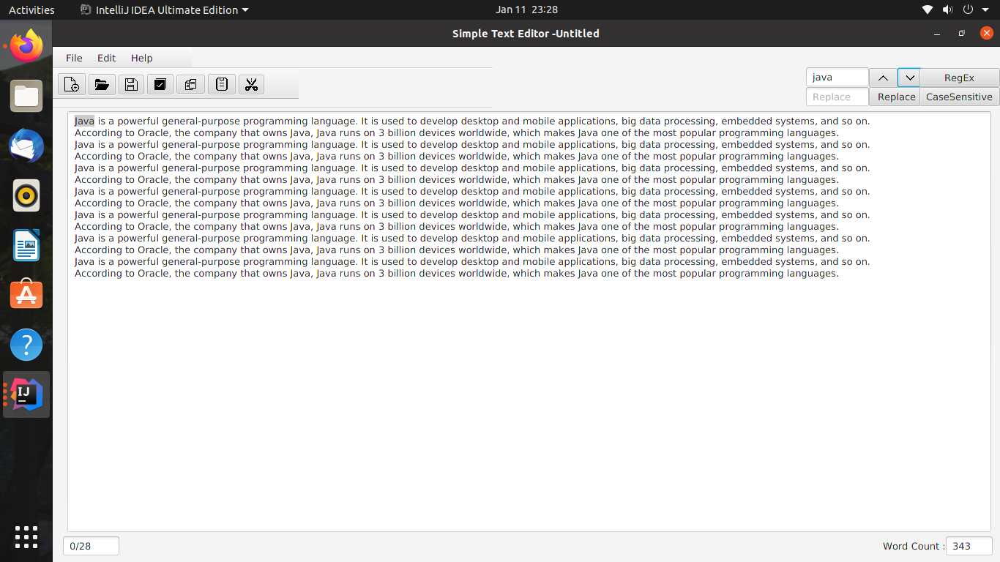

#Simple Text Editor

    
Table of Content

    <ol>
        <li>
            <a href="about-the-project">About the Project </a>
        </li>
        <li>
            <a href="getting-started">Getting Started</a>
        <ul>
            <a href="installation">Installation</a>
        </ul>
        </li>
        <li><a href="#usage">Usage</a></li>
        <li><a href="#licence">Usage</a></li>
        <li><a href="#contact">Usage</a></li>
    </ol>

## About the project

* This is a Simple text editing software developed by me.

## Getting Started

1. First clone the repository by using below link
   https://github.com/NalinGeeganage/Simple-Text-Editor.git

2. Once cloned, open the repository from the Intellij IDEA

3. Then build and run

## Usage

* It can read and write files.
* Can find and replace any word that user having with the feature of case-sensitive and Regular expression

## License

Copyright &copy; 2022 - present NalinGeeganage. All Right reserved.

Licensed under the [MIT](LICENSE.txt) license.

### Contact
[e-mail]() - nalinruwn1996@gmail.com
